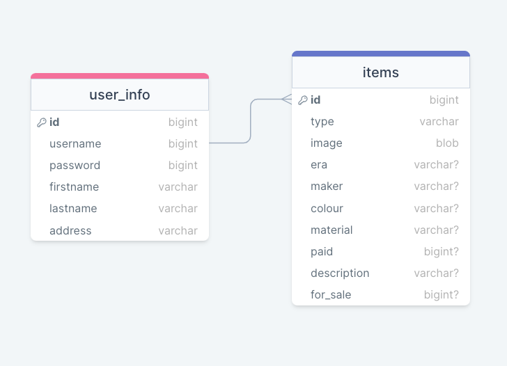

# Jewellery Inventory

## Setup

### Node.js

- You will need to have node installed and run `npm install` in both the - main project folder and client folder.

### Database Prep

- Access the MySQL interface in your terminal by running `mysql -u root -p`, and adding your password.
- Add a `.env` file to the project folder of this repository containing the MySQL authentication information for MySQL user. For example:

  DB_HOST=localhost
  DB_USER=root
  DB_NAME=inventory
  DB_PASS=YOURPASSWORD

- Run the following commands to your MySQL console: `CREATE DATABASE inventory;` and then `USE inventory;`
- Run `npm run migrate` in the project folder of this repository, in a new terminal window.
- This is the current database schema. Only the items table is currently being used.
  

### Development

- Run `npm start` in project directory to start the Express server on port 4000. It's recommended to use `nodemon` for automatic server restarts during development. If you don't have `nodemon` installed, you can install it globally using `npm install -g nodemon`.
- In another terminal, navigate to the `client` directory (`cd client`) and run `npm run dev` to start the client in development mode with hot reloading in port 5173.
